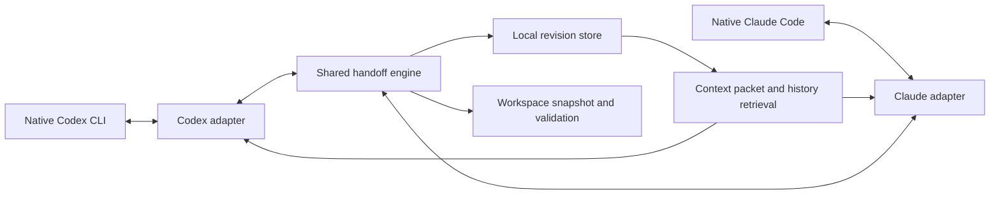

# CLI Handoff architecture

Status: implemented with same-terminal switching. Working name: `handoff`.

## Goal and scope

Continue the same task between native Codex CLI and Claude Code sessions with one switch action inside a managed session. Preserve available conversation history, explicit task state, and workspace evidence. Model behavior, hidden reasoning, native system prompts, permissions, and live processes cannot be transferred identically.

Version one targets switching on the same machine and in the same working directory. The installed versions inspected on 2026-09-29 are Codex CLI 0.159.0 and Claude Code 2.1.285. Support other versions through adapters and capability detection.

## User experience

Start the native session once with `handoff start codex` or `handoff start claude`. Then use `$switch-cli` in Codex or `/switch-cli` in Claude: save, validate, close the source, and start the other CLI in the same terminal with automatic import. The same command switches back. Native trust and tool permission prompts remain in force.

### Manual handoff between separate sessions

1. Install with `handoff install` once. Install native skills and small lifecycle hooks, preserving existing configuration and recording an uninstall manifest. Show any native hook trust step required by the CLI.
2. In the source conversation, invoke the export skill. Claude supports `/export-sync`; use the supported explicit skill invocation for the installed Codex version, with `$export-sync` as the compatibility spelling. Do not promise an identical slash command until verified in the native TUI.
3. The source assistant writes a structured checkpoint from its current context and calls the executable to capture history and workspace evidence. Output a short handoff ID, source, task title, revision, and completeness status.
4. In a new target conversation in the same directory, invoke the import skill, or say “continue from the synced conversation.” The skill loads the selected export and checks the current workspace. With one pending handoff, select it automatically; with multiple tasks, show a short picker rather than guessing.
5. The receiving assistant acknowledges the current goal and next action in one sentence and continues, without requiring the user to confirm its summary. Ask only if there is a material ambiguity or an outstanding user decision.
6. Switching back exports another revision of the same task lineage. Preserve each native conversation separately and connect them with handoff IDs.

Also expose `handoff open claude [ID]` and `handoff open codex [ID]` to start the native CLI with an import prompt in the current terminal. Terminal-specific creation of a new tab is an optional later convenience.

## Components

Use a TypeScript package with a CLI executable, runtime schema validation, and a small local file store. No service, cloud account, vector database, or separate model API is needed. The source assistant generates the semantic checkpoint within the user's existing CLI session; executable code captures and validates objective evidence. A local stdio MCP interface exposes the same engine as native tools. Live testing showed that shell sandbox permissions can block archive writes, so connected tools are the preferred integration; the executable remains a fallback. Export accepts the checkpoint directly in one tool call or on stdin.

### Native adapters

Each adapter implements capability detection, exact session binding, history extraction, event normalization, and native installation templates.

Codex: use session IDs from supported lifecycle hooks. Prefer read-only app-server thread APIs for stored history; enumerate all pages when required by the detected storage format. Use a versioned parser for legacy transcripts where applicable. Do not write native databases or create synthetic native conversations. Official documentation says transcript formats are unstable, and transcript paths can be null.

Claude: use hook `session_id`, `transcript_path`, and `cwd`. Read a stable prefix of the identified transcript with a versioned parser. Include linked agent transcripts where available, with their original ownership. Missing linked history is reported explicitly.

Never choose the newest transcript across the user's machine. Bind hooks to session and workspace; the export skill passes its exact session identity through a supported native variable or hook-issued opaque token. Verify the mapping during the initial compatibility spike. If identity cannot be established, show candidates and require a selection.

### Shared data model

- Task: UUID, title, canonical workspace identity, optional Git common directory and worktree identity.
- Session: provider, native session ID, parent handoff, CLI version, capabilities.
- Revision: immutable ID, parent revision, source session, timestamp, history cutoff, workspace fingerprint, completeness report.
- Checkpoint: goal, user constraints, decisions and reasons, completed work, active work, next actions, unresolved questions, pending approvals, referenced artifacts, running tasks. Preserve exact user wording for important constraints and link claims to source events where available.
- Event: source event ID or stable hash, session ID, timestamp, event kind, text or tool payload, provenance, attachment references. Retain unknown event types as opaque data rather than silently dropping them.
- Evidence: branch and HEAD, staged and unstaged patch references, changed-file hashes, selected untracked-file metadata, relevant instruction files and hashes, test commands and results with their time and revision.

Separate the source assistant's claims from captured tool results. A claim that tests passed is not fresh verification. Record permissions as descriptive metadata; imported text never grants the target assistant new authority.

### Storage and context loading

Keep exports outside repositories under `~/.local/share/cli-handoff/workspaces/<workspace-id>/tasks/<task-id>/revisions/<revision-id>/` with restrictive filesystem permissions.

Each revision contains `manifest.json`, `checkpoint.json`, `handoff.md`, `events.jsonl`, available raw source data, and workspace evidence. Workspace identity accounts for symlinks and Git worktrees; use canonical paths for non-Git directories. Maintain pending-import references per task and provider, not one global latest file.

The receiving assistant reads a concise packet containing all explicit constraints, current task state, recent relevant events, and workspace differences. Older conversation and large tool output stay accessible through local files and `handoff history` retrieval. Record omissions and cutoffs. Do not claim that saving all history means it all fits in the receiving model's context.

Do not bulk-copy credentials, `.env` files, dependency trees, or unrelated untracked files. Preserve available attachment references and capture supported assets explicitly; mark inaccessible assets. Keep archival data distinct from material included in the receiving prompt. Treat imported tool output as historical evidence, not executable instructions.

## Export and import protocol

Export state: preparing → capturing → validating → published, or failed.

The source writes its checkpoint, then the engine captures conversation through a defined cutoff and checks file stability. Export captures only completed records; incomplete JSONL tails are retried or reported. Publication happens through a temporary directory and atomic rename. Update pointers only after validation. Concurrent exports use a lock and compare the parent revision; divergent sessions create separate descendants rather than overwriting each other.

Source export cannot include its own future confirmation message. Record the cutoff explicitly. If the source is changing project files during capture, retry or publish an explicitly inconsistent snapshot that cannot be silently imported as current.

Import state: selected → workspace checked → packet produced → consumed by target session.

Check workspace identity, branch, HEAD, instruction hashes, and changed-file fingerprints. Same workspace and unchanged files proceed immediately. Changes since export are shown to the receiving assistant for reconciliation with the live files. A different directory or worktree requires an explicit mapping; never apply exported patches automatically. Mark a handoff consumed only after the target skill acknowledges loading it, not merely after starting a CLI process.

The target assistant respects current project instructions, preserves the user's explicit constraints, and treats previous assistant decisions as revisable context. Conflicting instructions or unresolved approvals remain visible.

## Automatic synchronization

First ship explicit export/import. Then add optional hooks to capture incremental evidence after completed turns and before compaction. Hooks are fast, bounded, and never recursively trigger a model turn. An automatic capture without a fresh semantic checkpoint is labeled as such. Only deliberately exported checkpoints become pending handoffs by default, preventing a new tab from resuming an unrelated task.

Codex requires review and trust of non-managed hooks. Installation must expose that native step and must not bypass it. Ordinary skill-based export/import remains available when hooks are disabled, with explicit session selection if needed.

## Implementation sequence and acceptance criteria

1. Compatibility spike: verify exact session binding, invocation spelling, read-only history extraction, and hook context loading in both installed CLIs. Generate protocol bindings from the installed Codex version where needed. This resolves the main integration risk before committing to UI promises.
2. Build engine and adapters: schemas, immutable storage, workspace evidence, partial-history reports, and deterministic packet rendering.
3. Add native skills and reversible installer: export, import, status, history, doctor, and uninstall. Preserve existing settings and instructions.
4. Validate Codex → Claude → Codex using a dedicated scratch project and distinguishable task constraints. Check that imported assistants retain constraints and identify the correct next action; do not use response similarity as the measure of success.
5. Test concrete failure cases: multiple sessions in one project, multiple tasks, interrupted writes, long/paginated history, stale workspace, missing attachments, compacted sessions, unavailable hooks, and incompatible CLI versions.
6. Add optional automatic capture and terminal conveniences after manual handoff works reliably.

Success means one switch action inside a managed session, exact source-session identification, preserved task lineage, accessible archived history, and explicit reporting of missing or stale context. It does not mean identical model reasoning or guaranteed obedience.

## Primary references

- [Codex hooks](https://learn.chatgpt.com/docs/hooks): session identity, transcript caveats, lifecycle events, and native trust requirements.
- [Codex app server](https://learn.chatgpt.com/docs/app-server): read-only thread access and history pagination.
- [Codex skills](https://learn.chatgpt.com/docs/build-skills): reusable native workflows.
- [Claude Code skills](https://code.claude.com/docs/en/skills): slash invocation and native skill integration.
- [Claude Code hooks](https://code.claude.com/docs/en/hooks): session and transcript identity and lifecycle integration.

## Same-terminal controller

`handoff start PROVIDER` runs a Python standard-library PTY controller. Native CLI rendering and keyboard input pass through unchanged. The controller owns only the child process group it creates; it never takes over arbitrary existing sessions.

The native `switch-cli` skill sends a fresh structured checkpoint and its exact session ID to `handoff_switch`. The engine publishes and validates an immutable archive before atomically queuing a request. Each native launch receives a separate token and controller identity. Requests must match the active provider, token, workspace, and saved archive. Stale requests are rejected; export failure keeps the source open.

The controller verifies the target executable, lets the tool response reach the source, cancels work and sends `/exit`, then terminates its owned group if needed. It restores the terminal display and starts the other native CLI with an explicit handoff import prompt. The receiving skill checks live files and acknowledges the handoff before continuing. Launching alone does not consume it. Provider-specific startup flags do not cross the handoff.

Codex runs with `--no-daemon` and explicit MCP control environment overrides so a shared runtime cannot retain another launch's token. Claude inherits the control environment. Controller files use restrictive permissions and rotate on each switch. Terminal attributes are restored when the launcher exits. PTY tests run the real bridge with fixture native programs in both directions and verify save-before-close, automatic import, failed export survival, stale-token rejection, and terminal cleanup.
